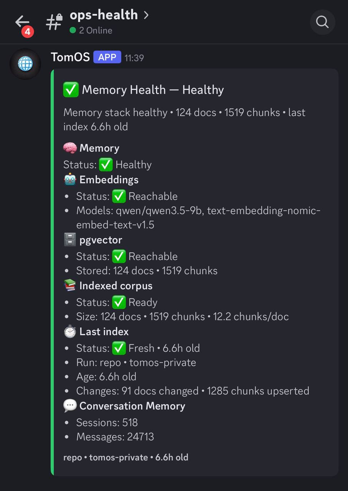

# Discord Alerts



Set up Discord webhooks for memory stack health alerts.

## Overview

When something goes wrong with your memory stack, Discord alerts notify you immediately.

## Prerequisites

- A Discord server where you have permission to create webhooks
- A channel to receive alerts

## Creating a Discord Webhook

1. Open Discord → Server Settings → Integrations
2. Click "Create Webhook" or "New Webhook"
3. Name it (e.g., "OpenClaw Memory")
4. Select the channel
5. Copy the webhook URL

## Configuring

### Set Environment Variable

```bash
export DISCORD_MEMORY_WEBHOOK_URL="https://discord.com/api/webhooks/..."
```

Or add to `.env`:

```
DISCORD_MEMORY_WEBHOOK_URL=https://discord.com/api/webhooks/...
```

### Test the Connection

```bash
python scripts/memory_discord_alert.py --dry-run
```

This shows what would be posted without sending.

### Send Alerts

```bash
# Post only when unhealthy (recommended)
python scripts/memory_discord_alert.py

# Always post heartbeat
python scripts/memory_discord_alert.py --always-post
```

## Alert Types

### Health Failure

```
🔴 OpenClaw Memory Stack Alert
• LM Studio: UNREACHABLE
• pgvector: OK
```

### Stale Index

```
🟡 OpenClaw Memory Stack Warning
• Index is stale (26 hours old)
• Last run: 2024-01-15 14:32:00
```

### Healthy (with --always-post)

```
🟢 OpenClaw Memory Stack
• LM Studio: OK
• pgvector: OK
• Docs: 142 | Chunks: 1,203
```

## Cron Setup

### Basic (Post Only on Problems)

```bash
# Health check every hour
0 * * * * cd /path/to/openclaw-memory-stack && \
  DISCORD_MEMORY_WEBHOOK_URL="https://..." \
  python scripts/memory_discord_alert.py >> /var/log/openclaw-health.log 2>&1
```

### With Heartbeat

```bash
# Health + heartbeat every hour
0 * * * * cd /path/to/openclaw-memory-stack && \
  DISCORD_MEMORY_WEBHOOK_URL="https://..." \
  python scripts/memory_discord_alert.py --always-post >> /var/log/openclaw-health.log 2>&1
```

## Customizing Alerts

Edit `memory_discord_alert.py` to customize:

- Message format
- Thresholds
- Additional checks
- Different channels for different alerts

## Troubleshooting

### "Webhook URL is invalid"

- Ensure you copied the full URL (starts with `https://discord.com/api/webhooks/`)
- Check the webhook wasn't deleted

### "Nothing is posted"

- Check environment variable is set
- Run with `--dry-run` to debug
- Check cron logs for errors

### "Too many messages"

- Remove `--always-post`
- Increase cron interval
- Check `never_index` to reduce indexing load

## Security

- Never commit webhook URLs to git
- Use environment variables or `.env` (which should be in `.gitignore`)
- Rotate webhooks periodically
